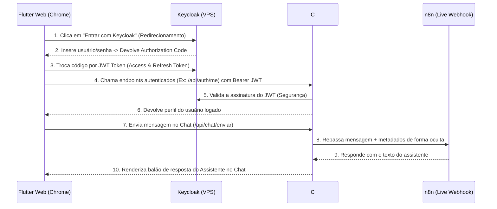

# 🚀 Guia de Execução e Testes do Projeto Bravito

Este guia explica como executar e testar a aplicação **Bravito** (Login integrado com Keycloak + Tela de Chat conectada ao n8n) utilizando o seu computador local para a execução dos serviços, mas aproveitando a infraestrutura de autenticação do **Keycloak que já está ativa na sua VPS**.

Essa abordagem híbrida é a mais rápida e 100% confiável, pois:
1. **Evita a necessidade de rodar Docker localmente** (já que o banco de dados e o Keycloak na VPS cuidam da parte pesada).
2. **Ignora as limitações de compilação do Android no Windows** devido a caminhos com acentos (como `Rsul Automaçoes`).
3. **Oferece Hot-Reload no frontend** para você testar mudanças visualmente em tempo real.

---

## 🗺️ Visão Geral do Fluxo de Teste



---

## 🛠️ Passo a Passo para Rodar e Testar

### 🖥️ Passo 1: Executar a API C# (Backend) Localmente
A API foi atualizada para aceitar requisições de qualquer porta vinda do seu `localhost` (CORS ativado) e validar a assinatura dos tokens diretamente com o seu Keycloak de produção da VPS.

1. Abra um terminal no seu computador e navegue até a pasta da API:
   ```powershell
   cd "d:\Potter\Rsul Automacoes\Projetos\bravito\backend"
   ```
2. Execute o projeto C# usando o comando do .NET Core SDK:
   ```powershell
   dotnet run --project src/Bravito.Api
   ```
3. A API compilará em segundos e iniciará. O terminal exibirá mensagens parecidas com:
   ```text
   info: Microsoft.Hosting.Lifetime[14]
         Now listening on: http://localhost:5132
   info: Microsoft.Hosting.Lifetime[14]
         Now listening on: https://localhost:7096
   ```

> [!TIP]
> A API está configurada para escutar em **`http://localhost:5132`**. Mantenha este terminal aberto!

---

### 🌐 Passo 2: Executar o Frontend (Flutter Web)
Para evitar o bug clássico de redimensionamento do motor gráfico `CanvasKit` do Flutter no Windows Chrome (`_viewInsets.isNonNegative`), forçaremos o Flutter a usar o renderizador gráfico **HTML**.

1. Abra um **segundo terminal** (mantenha o terminal da API aberto e rodando!) e vá até a pasta do Flutter:
   ```powershell
   cd "d:\Potter\Rsul Automacoes\Projetos\bravito\frontend\bravito_app"
   ```
2. Inicie a aplicação no Chrome forçando o renderizador HTML:
   ```powershell
   flutter run -d chrome
   ```
3. O Flutter compilará o app e abrirá automaticamente uma aba no seu Google Chrome com a tela do Bravito.

---

## 🧪 Como Testar a Jornada do Usuário

1. **A Tela de Login**:
   - Assim que o app abrir no Chrome, você será apresentado à tela corporativa oficial do Bravito.
   - Clique no botão dourado **"Entrar com Keycloak"**.

2. **Fluxo de Login (Keycloak)**:
   - Você será redirecionado para a página oficial do Keycloak hospedada na sua VPS (`bravito-keycloak.lchoyg.easypanel.host`).
   - Insira as credenciais de teste criadas no Realm:
     - 📧 **Usuário:** `teste`
     - 🔑 **Senha:** `Bravida@2023!`
   - Clique em **Log In**.

3. **Tela de Chat Dinâmica**:
   - Após a validação rápida, o Keycloak te devolverá para o aplicativo no Chrome.
   - O Flutter detectará o login com sucesso, chamará o endpoint local `/api/auth/me` para pegar o seu perfil e abrirá a **Tela de Chat do Bravito**.
   - Digite uma mensagem de teste na caixa inferior (ex: *"Olá, quem é você?"*) e envie.
   - O aplicativo exibirá seu balão de texto em azul e mostrará um indicador de carregamento.
   - A API local repassará sua mensagem com segurança para o assistente no **n8n** e renderizará a resposta dinamicamente na tela!

---

## 🛠️ Resolução de Problemas & Diagnósticos

### ❓ A API na VPS continua com "502 Bad Gateway" no Easypanel. O que fazer?
O erro `502 Bad Gateway` no Easypanel acontece quando o proxy reverso tenta encaminhar uma chamada para o contêiner Docker da API, mas o contêiner não está respondendo (ou caiu durante a inicialização).

**Como corrigir nas configurações do seu App no Easypanel:**
1. Acesse o seu dashboard no **Easypanel** e clique no App correspondente à sua API C# (`bravito-app-bravito`).
2. Vá até a aba **"Environment"** (Variáveis de Ambiente) e certifique-se de preencher as variáveis do Keycloak que a API necessita para iniciar sem travar. Adicione:
   - `Keycloak__Authority` = `https://bravito-keycloak.lchoyg.easypanel.host/realms/bravito`
   - `Keycloak__Audience` = `bravito-api`
   - `Keycloak__RequireHttpsMetadata` = `true`
3. Salve as alterações.
4. Vá para a aba **"Deployments"** e clique em **"Force Redeploy"**.
5. Clique em **"Logs"** e acompanhe a inicialização do contêiner. Se houver algum erro de inicialização do C#, ele será detalhado em texto puro ali!
